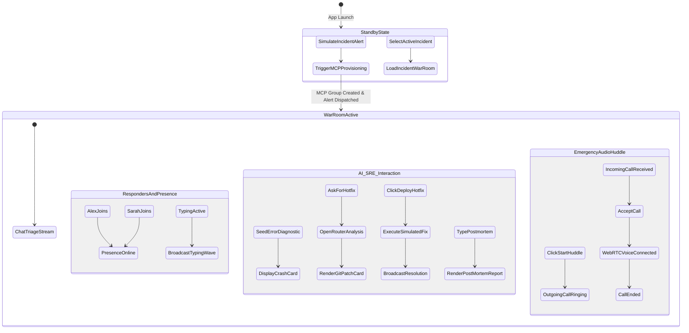

# 🔄 Application Flow & User Journeys (APP_FLOW)
## Project: OpsPulse — Autonomous SRE & Real-Time Incident War Room
### Hackathon: Zero to Chat (CometChat Hackathon)

---

### 1. Overall System State & Navigation Diagram



---

### 2. Detailed User Journey Walkthroughs

#### 2.1 Journey 1: Incident Trigger & Autonomous MCP Provisioning
```
[Production Outage / Simulated Webhook Trigger]
         │
         ▼
[CometChat MCP Server invoked via Agent / CLI]
   ├── Action: cometchat.create_group("inc-409-auth-outage", type="public")
   ├── Action: cometchat.add_members(["alex_oncall", "sarah_lead", "ai_sre_bot"])
   └── Action: cometchat.send_message(alertPayload)
         │
         ▼
[Incident War Room appears instantly in OpsPulse UI]
   └── Red SEV-1 Alert Badge, Error Stack Trace, and Impact Metrics rendered
```

#### 2.2 Journey 2: Responders Enter & Collaborate in Real-Time
```
[Alex (On-Call) opens #inc-409-auth-outage War Room]
         │
         ▼
[CometChat connects WebSocket & syncs previous messages]
         │
         ▼
[Sarah (SRE Lead) enters from second browser window]
   ├── Alex sees Sarah's presence indicator turn green (Online)
   │
   ▼
[Alex types: "Investigating the null pointer exception..."]
   ├── CometChat.startTyping() fires
   ├── Sarah's window renders animated typing indicator: "Alex is typing…"
   └── Alex presses Enter -> message delivered instantly with double checkmark (✓✓)
```

#### 2.3 Journey 3: Emergency WebRTC Voice Huddle (CometChat Calling SDK)
```
[Alex clicks "Join Audio War Room" / "Emergency Huddle" in chat header]
         │
         ▼
[CometChat Calling SDK initiates call session]
         │
         ├── Audio chime plays + outgoing modal displayed for Alex
         │
         ▼
[Sarah receives CometChat.CALL_TYPE.AUDIO incoming call alert]
   └── Glassmorphic popup: "Incoming Emergency War Room Call from Alex"
         │
         ├── Sarah clicks "Accept"
         │
         ▼
[CometChat establishes WebRTC Audio connection]
   └── Responders speak with zero latency while simultaneously typing in chat
```

#### 2.4 Journey 4: AI SRE Diagnostic, Git Patch Card & 1-Click Deploy
```
[Alex types: "@SRE generate hotfix patch" or clicks [/hotfix] chip]
         │
         ▼
[Backend calls OpenRouter Free Tier (LLaMA 3.3 70B:free with failover)]
   ├── Ingests recent error trace and failing file context
   └── Generates structured unified diff and explanation
         │
         ▼
[AI SRE posts Interactive Git Patch Card in CometChat stream]
   ├── Syntax-highlighted diff:
   │     - const token = req.headers.authorization.split(" ")[1];
   │     + const token = req.headers.authorization?.split(" ")[1] || null;
   ├── Interactive Button: [ 🚀 Approve & Deploy Hotfix ]
   └── Interactive Button: [ ⏪ Rollback Recent Commit ]
         │
         ▼
[Sarah clicks "Approve & Deploy Hotfix"]
   ├── Backend simulates hotfix deployment & restarts health checks
   └── AI SRE broadcasts: "✅ Hotfix deployed. Health check: 200 OK. MTTR: 2m 14s."
```

#### 2.5 Journey 5: Automated Post-Mortem Report Generation
```
[Alex executes "/postmortem" command or clicks [/postmortem] chip]
         │
         ▼
[Backend compiles full war room audit log]
   ├── Timeline of events from alert to resolution
   ├── Root cause summary and affected components
   └── Preventative action items with assigned owners
         │
         ▼
[Full-width markdown Post-Mortem Card rendered in chat with "Copy Report" button]
```

---

### 3. Interactive Element Click & Response Matrix

| Interactive Control | User Action | Immediate UI Response | Network / SDK Action |
| :--- | :--- | :--- | :--- |
| **"Trigger Demo Alert"** | Click header button | Spawns incident card with red pulse | Calls `/api/incident/trigger` & MCP |
| **"Join Audio War Room"** | Click Phone icon | Opens call modal with pulsing radar | Calls `CometChat.initiateCall(AUDIO)` |
| **"Accept Huddle"** | Click green button | Closes modal, opens call toolbar | Calls `CometChat.acceptCall(sessionId)` |
| **Message Input** | Type characters | Character feedback in input | Debounced `CometChat.startTyping()` |
| **Send Button / Enter** | Click or Enter | Appends message bubble | Calls `CometChat.sendMessage(text)` |
| **"Approve & Deploy"** | Click button on patch | Button shows "Deploying…" spinner | Calls `/api/sre/deploy` & emits bot message |
| **"/postmortem" Chip** | Click quick prompt | Displays "Generating report…" | Calls `/api/sre/postmortem` |
| **"End Huddle"** | Click red pill button | Closes call bar, restores chat | Calls `CometChat.endCall(sessionId)` |
